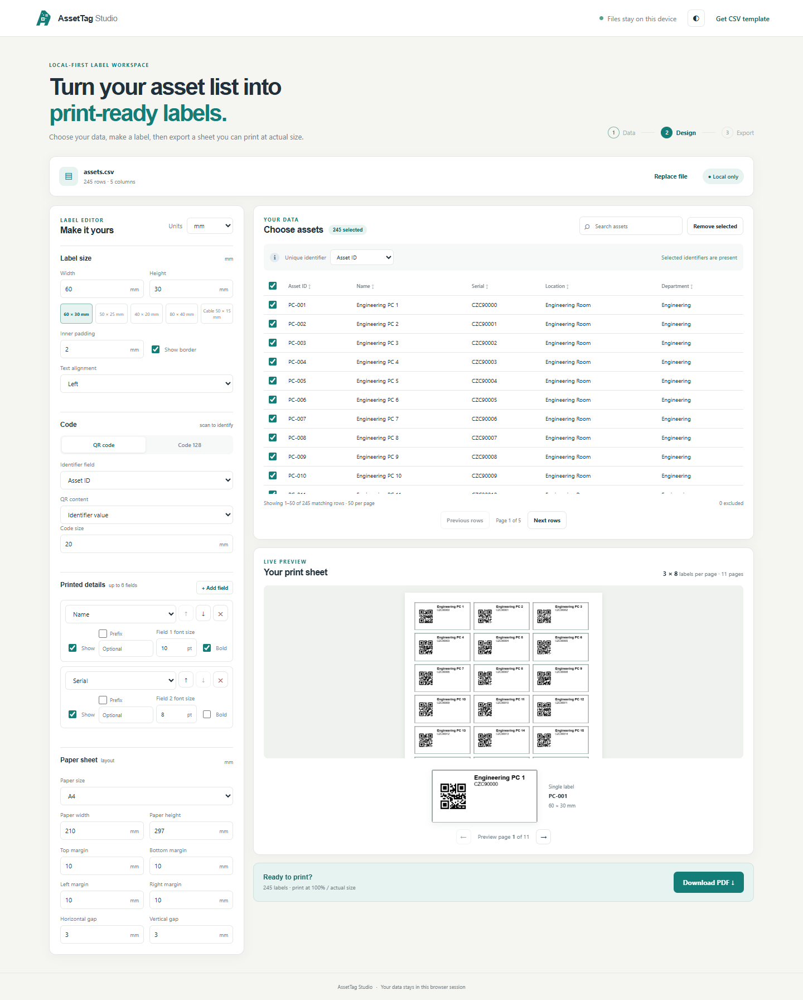
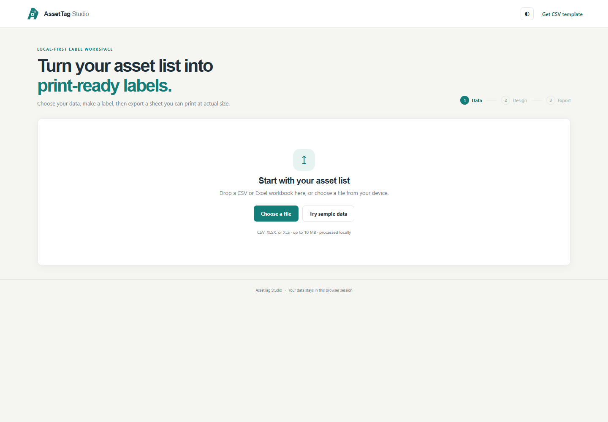

# AssetTag Studio

Turn spreadsheet inventory into print-ready QR and Code 128 labels, entirely in your browser.



**No login, no backend, no inventory uploads.** Import CSV or Excel, choose an identifier, configure a label and export a PDF sheet at actual physical size.

## Why it exists

Equipment lists already live in spreadsheets. Producing consistent labels should not require copying hundreds of QR codes into a document or giving a cloud service private inventory.

## Features

- CSV, XLSX and legacy XLS; workbook sheet selection and import diagnostics
- Search, sort, select and remove rows; generic column names
- QR raw values or payload templates and Code 128 barcodes
- Structured fields with visibility, ordering, prefixes, fonts, bold and alignment
- Label presets/custom dimensions, padding and borders
- A4, US Letter, A5 and custom paper; mm/inches, margins and gaps
- Paginated print preview, multi-page PDF, progress and cancellation
- Demo data, sample template, light/dark theme and keyboard-friendly controls

## Demo workflow

Choose **Try Demo Data**, select an identifier, edit visible fields, pick 60 × 30 mm labels and A4, then export. Print at **100% / actual size**, with fit-to-page disabled.



[Example PDF](docs/media/sample-labels.pdf). Live deployment setup is in [deployment.md](docs/deployment.md); no unverified demo URL is advertised.

## Privacy

Records stay in browser memory; only preferences persist. No analytics, remote processing or spreadsheet-content requests. Reload clears records. See [privacy](docs/privacy.md).

## Architecture

One normalized data model, one millimeter layout engine, one shared renderer for preview/PDF. This is a spreadsheet-to-physical-label workflow, not a spreadsheet editor. [Architecture diagram](docs/architecture.md).

## Running locally

Requires Node 24 and npm.

```sh
npm ci
npm run dev
```

## Testing

```sh
npm run typecheck
npm run lint
npm test
npx playwright install chromium
npm run test:e2e
npm run build
npm audit
```

CI runs these checks on PRs and main/web-deployment pushes. Read [implementation progress](docs/implementation/progress.md) for actual verification results.

## Deployment

Vite builds static dist files for Cloudflare Pages. No runtime environment secrets required. [Setup, headers and acceptance checks](docs/deployment.md).

## Limitations

Imported files and rendered codes have documented resource limits. Compressed Excel content can still consume browser memory. Code 128 supports its permitted character range; use QR for international identifiers. Dense codes, crowded fields or impossible page grids require changing settings. Print accuracy also depends on printer hardware and actual-size settings. PDF labels are raster images placed at exact dimensions; they are not searchable text. Large exports consume memory and time.

## Future work

Saved templates, logo/image fields, additional symbologies, printer profiles, offline installation and FieldLens presets are intentionally outside the MVP.

## License

No project license has been chosen by the repository owner. Third-party dependency licenses still apply; do not assume permission to redistribute this project beyond the owner's authorization.

