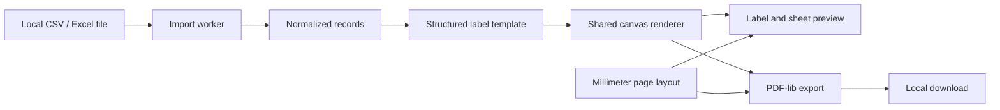

# Architecture

AssetTag Studio turns a local CSV or Excel worksheet into a physical label sheet. The app is a static React and TypeScript site; parsing, preview rendering, and PDF creation run in the browser.

CSV and Excel data normalize to the same string-valued record model, so users can select any source column as the identifier. A structured template controls code content, label dimensions, visible fields, and formatting. One renderer supplies the label image used by both the preview and PDF. A pure layout function positions labels in millimeters, which keeps the preview grid and PDF placement aligned.

The PDF is the print artifact and uses the requested physical page and label dimensions. Print it at 100% or actual size. Label text and codes are raster images in the PDF, so the PDF is not searchable text.

Import runs in a worker with limits on file size, rows, columns, and cell lengths. Interrupted imports can terminate the worker. PDF generation works in batches, reports progress, and supports cancellation. The table and sheet preview paginate to limit rendered DOM. Compressed workbooks and large PDFs can still use substantial device memory.

Records remain in memory for the open session; validated UI preferences alone use localStorage. The app has no account, application backend, analytics, or inventory upload. Static hosting still receives ordinary asset requests. See [privacy](privacy.md), [deployment](deployment.md), and the detailed [implementation contracts](implementation/architecture.md).

## Architecture decisions

- [Client-only processing](adr/0001-client-only-processing.md) keeps inventory in the browser.
- [One normalized record model](adr/0002-normalized-record-model.md) makes CSV and Excel share the same editing workflow.
- [Millimeters as canonical units](adr/0003-millimeters-as-canonical-units.md) preserves physical layout across unit controls and export.
- [Structured label templates](adr/0004-structured-label-templates.md) provide consistent editing without a free-position canvas.
- [PDF as the print artifact](adr/0005-pdf-as-print-artifact.md) gives preview and download one physical layout contract.
