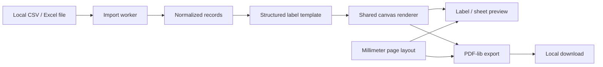

# Architecture

React state owns the workspace. Data remains in memory, and validated preferences alone use localStorage. CSV uses Papa Parse; Excel uses the official SheetJS 0.20.3 package with pinned lock integrity. Both normalize to generic string-valued records, with no required column names.

The structured template controls dimensions, code, visible fields and text formatting. The renderer produces the same PNG for preview and PDF, including Unicode browser text. Pure millimeter layout determines grid and physical placement. PDF-lib embeds images at exact dimensions without printer scaling.

Browser workers isolate import and can be terminated on errors/timeouts. PDF export yields between batches and supports cancellation. The table and preview paginate instead of creating thousands of DOM nodes. Limits protect ordinary resource usage, but compressed workbook expansion can still consume substantial browser memory.

See [implementation contracts](implementation/architecture.md), [import format](import-format.md), [layout](label-layout.md), [PDF output](pdf-generation.md) and [privacy](privacy.md).

